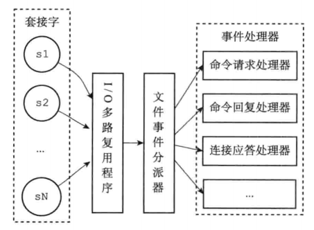

# AE_EPOLL

IO多路复用程序, 基于`linux epoll`实现，IO多路复用能显著提高程序响应速度已经高并发能力，使用单线程加IO多路复用模型能够免去以往多线程协调所带来的额外开销，并获得更高的并发量而不必去考虑多线程协调的问题，`Nginx`, `Redis`, `Netty`等能够如此快速也是基于此。此项目在学习了`Redis`之后完成，作为`Redis`学习的收尾项目。

**IO多路复用设计思路**

## 智能家居管理系统

将多个单片机连接上IO多路复用程序，做个家庭管理系统，监控温度、光照、家电管理等，并支持远程管理家庭相关BSP设备。设计思路是将BSP设备连接上主机(串口，蓝牙，wifi等）IO多路程序程序均将其抽象为文件事件，并进行事件监听，分发相应读写事件处理器，并将其数据进行持久化处理，远程操控通过网络进行。

